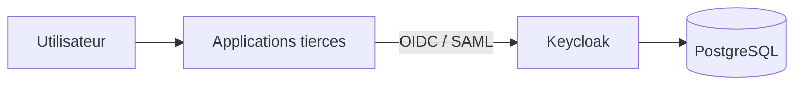

# Keycloak IAM Platform

Base Docker Compose pour déployer `Keycloak` avec `PostgreSQL` comme plateforme d'identité centralisée.

Le dépôt est organisé pour refléter une approche classique en entreprise:

- `Keycloak` est exploité comme service d'authentification transverse
- les applications tierces sont intégrées séparément
- chaque intégration SSO est documentée dans son propre guide

## Objectif

Ce projet a pour objectif de:

- déployer une base Keycloak propre
- structurer un realm, des rôles, des groupes et des utilisateurs
- documenter l'intégration SSO d'applications tierces
- fournir un cadre réutilisable pour d'autres applications

## Architecture



## Documentation

- [Architecture IAM](docs/architecture.md)
- [Checklist d'administration Keycloak](docs/keycloak-admin-checklist.md)
- [Intégration Grafana](docs/integrations/grafana.md)

## Structure

```text
.
├── Dockerfile
├── docker-compose.yml
├── README.md
├── docs/
│   ├── architecture.md
│   ├── images/
│   ├── keycloak-admin-checklist.md
│   └── integrations/
│       └── grafana.md
├── deployments/
│   └── grafana/
│       ├── .env.example
│       └── docker-compose.yml
└── themes/
    └── company/
        └── login/
```

## Services

| Service | Rôle | URL locale |
| --- | --- | --- |
| Keycloak | Fournisseur d'identité | `http://localhost:8080` |
| Administration Keycloak | Console d'administration | `http://localhost:8080/admin` |
| PostgreSQL | Base de données Keycloak | `localhost:5432` |
| Health Keycloak | Supervision | `http://localhost:9000/health/ready` |

## Démarrage

1. Copier les variables d'exemple:

```bash
cp .env.example .env
```

2. Ajuster les paramètres nécessaires.

3. Démarrer Keycloak:

```bash
docker compose up -d --build
```

4. Ouvrir l'administration:

- `http://localhost:8080/admin`

## Intégration d'applications tierces

Le principe du dépôt est simple:

- Keycloak est déployé ici comme plateforme IAM
- les applications tierces sont raccordées ensuite
- chaque intégration est documentée séparément

Exemple fourni:

- [Grafana](docs/integrations/grafana.md)

Un exemple de déploiement Grafana séparé est également fourni:

- [deployments/grafana/docker-compose.yml](deployments/grafana/docker-compose.yml)

## Variables d'environnement

Le fichier `.env` est proposé pour faciliter l'exécution locale.

Il reste indicatif:

- en environnement local, il simplifie le démarrage
- en environnement d'entreprise, les paramètres peuvent être injectés par le mécanisme de déploiement retenu

## Commandes utiles

Démarrer:

```bash
docker compose up -d --build
```

Consulter les logs:

```bash
docker compose logs -f keycloak
docker compose logs -f postgres
```

Arrêter:

```bash
docker compose down
```

Réinitialiser complètement:

```bash
docker compose down -v
docker compose up -d --build
```

## Recommandations

- publier Keycloak derrière HTTPS
- créer un compte administrateur permanent
- supprimer le compte bootstrap temporaire
- sauvegarder PostgreSQL
- documenter chaque intégration SSO application par application
