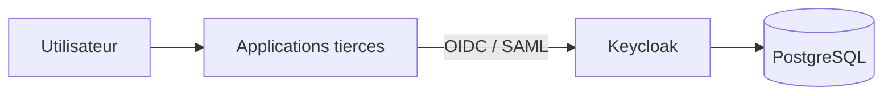

# Keycloak IAM Platform

Base Docker Compose professionnelle pour déployer `Keycloak` et `PostgreSQL` comme plateforme d'identité centralisée.

Le dépôt est centré sur `Keycloak` uniquement:

- la stack d'infrastructure ne contient pas les applications tierces
- les intégrations SSO sont documentées séparément
- la plateforme peut servir de socle pour Grafana, ArgoCD, Jenkins, Portainer ou d'autres applications

## Positionnement

Dans un contexte professionnel, `Keycloak` est généralement opéré comme une brique transverse d'authentification.

Ce dépôt suit cette logique:

- une stack dédiée `Keycloak + PostgreSQL`
- une documentation d'administration IAM
- une documentation séparée pour chaque intégration applicative

## Architecture



Documentation détaillée:

- [Architecture IAM](/root/Keycloak/docs/architecture.md)
- [Checklist administration Keycloak](/root/Keycloak/docs/keycloak-admin-checklist.md)
- [Integration Grafana SSO](/root/Keycloak/docs/integrations/grafana.md)

## Structure du dépôt

```text
.
├── Dockerfile
├── docker-compose.yml
├── README.md
├── docs/
│   ├── architecture.md
│   ├── keycloak-admin-checklist.md
│   └── integrations/
│       └── grafana.md
└── themes/
    └── company/
        └── login/
            ├── resources/
            │   └── css/
            └── theme.properties
```

## Services déployés

| Service | Rôle | URL locale |
| --- | --- | --- |
| Keycloak | Fournisseur d'identité | `http://localhost:8080` |
| Keycloak Admin | Console d'administration | `http://localhost:8080/admin` |
| PostgreSQL | Base de données Keycloak | `localhost:5432` |
| Health Keycloak | Supervision | `http://localhost:9000/health/ready` |

## Démarrage rapide

1. Copier les variables:

```bash
cp .env.example .env
```

2. Ajuster les secrets:

```env
KC_BOOTSTRAP_ADMIN_USERNAME=admin
KC_BOOTSTRAP_ADMIN_PASSWORD=ChangeThisAdminPassword!
KC_DB_PASSWORD=ChangeThisDatabasePassword!
```

3. Démarrer la plateforme:

```bash
docker compose up -d --build
```

4. Ouvrir:

- `http://localhost:8080/admin`

## Ce que couvre le dépôt

Ce dépôt t'aide à:

- déployer Keycloak proprement
- créer un realm manuellement
- structurer rôles, groupes et utilisateurs
- préparer des intégrations SSO avec des applications tierces
- documenter proprement chaque intégration

## Intégrations tierces

Chaque application tierce devrait avoir sa propre fiche d'intégration.

Exemple déjà documenté:

- [Grafana](/root/Keycloak/docs/integrations/grafana.md)

Une fiche d'intégration devrait contenir:

- le nom du client Keycloak
- le protocole utilisé
- les `redirect URIs`
- les `web origins`
- les rôles attendus
- les variables à configurer dans l'application
- les tests de validation

## Gestion des variables et secrets

Le fichier `.env` n'est pas obligatoire.

En pratique:

- `.env.example` documente les variables minimales
- `.env` est pratique en local
- en production, on préfère injecter les variables et secrets via l'outil de déploiement

Exemples de solutions plus professionnelles:

- variables CI/CD
- Docker secrets
- Kubernetes Secrets
- HashiCorp Vault
- AWS Secrets Manager
- Azure Key Vault

## Commandes utiles

Lancer:

```bash
docker compose up -d --build
```

Voir les logs:

```bash
docker compose logs -f keycloak
docker compose logs -f postgres
```

Arrêter:

```bash
docker compose down
```

Repartir de zéro:

```bash
docker compose down -v
docker compose up -d --build
```

## Recommandations de production

- publier Keycloak derrière HTTPS
- séparer la plateforme IAM des applications métiers
- ne jamais versionner de secrets réels
- créer un compte administrateur permanent et supprimer le compte bootstrap temporaire
- sauvegarder PostgreSQL
- tracer les intégrations SSO application par application
