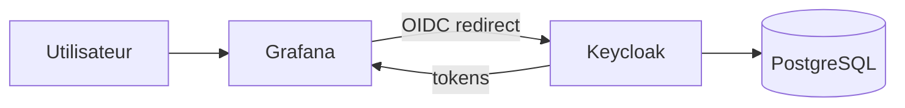

# Keycloak + Grafana SSO Stack

Stack Docker Compose prête à l'emploi pour déployer `Keycloak`, `PostgreSQL` et `Grafana` avec une intégration SSO OpenID Connect.

Le projet fournit:

- un déploiement local simple avec `docker compose`
- un realm Keycloak `company` importé automatiquement
- un thème de connexion personnalisé
- une configuration Grafana compatible SSO Keycloak
- un guide pour configurer le client Grafana manuellement dans Keycloak
- une documentation GitHub exploitable en démonstration, recette et base projet

## Architecture



Documentation détaillée:

- [Architecture détaillée](/root/Keycloak/docs/architecture.md)
- [Guide pas à pas Grafana SSO](/root/Keycloak/docs/grafana-sso-step-by-step.md)
- [Checklist visuelle admin Keycloak](/root/Keycloak/docs/keycloak-admin-checklist.md)

## Structure du dépôt

```text
.
├── Dockerfile
├── docker-compose.yml
├── README.md
├── docs/
│   ├── architecture.md
│   └── grafana-sso-step-by-step.md
├── realm/
│   └── company-realm.json
└── themes/
    └── company/
        └── login/
            ├── resources/
            │   └── css/
            └── theme.properties
```

## Services déployés

| Service | Rôle | URL locale |
| --- | --- | --- |
| Keycloak | Fournisseur d'identité | `http://localhost:8080` |
| Keycloak Admin | Administration IAM | `http://localhost:8080/admin` |
| Grafana | Application protégée par SSO | `http://localhost:3000` |
| PostgreSQL | Base de données Keycloak | `localhost:5432` |
| Health Keycloak | Supervision | `http://localhost:9000/health/ready` |

## Démarrage rapide

1. Copier les variables d'environnement:

```bash
cp .env.example .env
```

2. Ajuster les secrets si besoin.

3. Lancer la stack:

```bash
docker compose up -d --build
```

4. Ouvrir:

- `http://localhost:8080`
- `http://localhost:3000`

## Paramètres SSO recommandés

Le dépôt prépare Grafana pour utiliser un client Keycloak nommé `grafana-oauth`, mais le client doit être créé manuellement dans l'interface d'administration Keycloak pour faciliter l'apprentissage et la maîtrise du paramétrage.

Le mapping de rôles proposé côté Grafana est:

- `platform-admin` -> `Grafana Admin`
- `manager` -> `Grafana Editor`
- utilisateur authentifié -> `Grafana Viewer`

## Identifiants initiaux

Administration Keycloak:

- utilisateur: valeur `KC_BOOTSTRAP_ADMIN_USERNAME`
- mot de passe: valeur `KC_BOOTSTRAP_ADMIN_PASSWORD`

Utilisateur de démonstration:

- login: `owner@company.local`
- mot de passe initial: `ChangeMe123!`

Pense à remplacer immédiatement ces valeurs dans un contexte réel.

## Variables importantes

Exemples présents dans [.env.example](/root/Keycloak/.env.example):

- `KEYCLOAK_PUBLIC_URL`
- `KEYCLOAK_INTERNAL_URL`
- `KEYCLOAK_REALM`
- `GRAFANA_ROOT_URL`
- `GRAFANA_OAUTH_CLIENT_ID`
- `GRAFANA_OAUTH_CLIENT_SECRET`

Le détail du paramétrage manuel est documenté dans [docs/grafana-sso-step-by-step.md](/root/Keycloak/docs/grafana-sso-step-by-step.md).

## Commandes utiles

Lancer:

```bash
docker compose up -d --build
```

Suivre les logs:

```bash
docker compose logs -f keycloak
docker compose logs -f grafana
```

Arrêter:

```bash
docker compose down
```

Réinitialiser complètement:

```bash
docker compose down -v
```

## Recommandations de production

- publier Keycloak et Grafana derrière HTTPS
- remplacer tous les secrets de démonstration
- utiliser des noms DNS réels au lieu de `localhost`
- mettre à jour les `redirect URIs` et `web origins` dans Keycloak
- sauvegarder les volumes `postgres_data` et `grafana_data`

## Références utilisées

La configuration OAuth Grafana proposée suit la documentation officielle Generic OAuth de Grafana:

- https://grafana.com/docs/grafana/latest/setup-grafana/configure-access/configure-authentication/generic-oauth/
