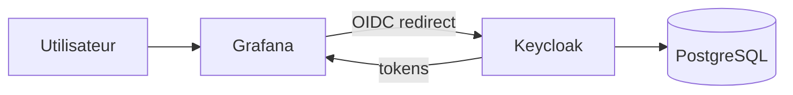

# Keycloak + Grafana SSO From Scratch

Stack Docker Compose professionnelle pour déployer `Keycloak`, `PostgreSQL` et `Grafana`, puis configurer manuellement un SSO OpenID Connect de bout en bout.

Le dépôt est volontairement orienté `from scratch`:

- aucun realm métier n'est préchargé
- aucune donnée de démonstration n'est importée
- la documentation explique comment construire la configuration dans Keycloak
- Grafana est prêt à consommer un client OIDC que tu créeras toi-même

## Objectif du projet

Ce projet sert à:

- démarrer rapidement une base technique Keycloak + Grafana
- apprendre à créer un realm Keycloak propre
- comprendre la création des rôles, groupes et utilisateurs
- connecter une application tierce à Keycloak avec OpenID Connect
- valider un SSO fonctionnel sur Grafana

## Architecture



Documentation détaillée:

- [Architecture détaillée](/root/Keycloak/docs/architecture.md)
- [Guide pas à pas Grafana SSO](/root/Keycloak/docs/grafana-sso-step-by-step.md)
- [Checklist visuelle admin Keycloak](/root/Keycloak/docs/keycloak-admin-checklist.md)

## Structure du dépôt

```text
.
├── Dockerfile
├── docker-compose.yml
├── README.md
├── docs/
│   ├── architecture.md
│   ├── grafana-sso-step-by-step.md
│   └── keycloak-admin-checklist.md
└── themes/
    └── company/
        └── login/
            ├── resources/
            │   └── css/
            └── theme.properties
```

## Services déployés

| Service | Rôle | URL locale |
| --- | --- | --- |
| Keycloak | Fournisseur d'identité | `http://localhost:8080` |
| Keycloak Admin | Administration IAM | `http://localhost:8080/admin` |
| Grafana | Application protégée par SSO | `http://localhost:3000` |
| PostgreSQL | Base de données Keycloak | `localhost:5432` |
| Health Keycloak | Supervision | `http://localhost:9000/health/ready` |

## Démarrage rapide

1. Copier les variables d'environnement:

```bash
cp .env.example .env
```

2. Ajuster les secrets.

3. Lancer la stack:

```bash
docker compose up -d --build
```

4. Ouvrir:

- `http://localhost:8080/admin`
- `http://localhost:3000`

## Ce que tu vas configurer à la main

La documentation du dépôt t'accompagne pour créer manuellement dans Keycloak:

- le realm `company`
- les rôles `platform-admin`, `manager`, `user`
- les groupes `admins`, `managers`, `employees`
- les utilisateurs de test
- le client OIDC `grafana-oauth`

Le mapping de rôles prévu côté Grafana est:

- `platform-admin` -> `Grafana Admin`
- `manager` -> `Grafana Editor`
- utilisateur authentifié -> `Grafana Viewer`

## Variables importantes

Exemples présents dans [.env.example](/root/Keycloak/.env.example):

- `KC_BOOTSTRAP_ADMIN_USERNAME`
- `KC_BOOTSTRAP_ADMIN_PASSWORD`
- `KEYCLOAK_REALM`
- `KEYCLOAK_PUBLIC_URL`
- `KEYCLOAK_INTERNAL_URL`
- `GRAFANA_ROOT_URL`
- `GRAFANA_OAUTH_CLIENT_ID`
- `GRAFANA_OAUTH_CLIENT_SECRET`

## Commandes utiles

Lancer la stack:

```bash
docker compose up -d --build
```

Voir les logs:

```bash
docker compose logs -f keycloak
docker compose logs -f grafana
```

Arrêter:

```bash
docker compose down
```

Repartir complètement de zéro:

```bash
docker compose down -v
docker compose up -d --build
```

## Recommandations de production

- publier Keycloak et Grafana derrière HTTPS
- remplacer tous les secrets de démonstration
- utiliser des noms DNS réels au lieu de `localhost`
- mettre à jour les `redirect URIs` et `web origins` dans Keycloak
- sauvegarder les volumes `postgres_data` et `grafana_data`

## Référence technique

La configuration OAuth Grafana proposée suit la documentation officielle Generic OAuth de Grafana:

- https://grafana.com/docs/grafana/latest/setup-grafana/configure-access/configure-authentication/generic-oauth/
