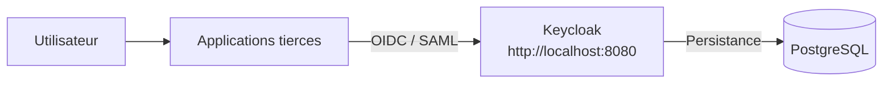

# Architecture IAM Keycloak

## Vue d'ensemble

Le dépôt orchestre deux composants d'infrastructure:

- `PostgreSQL` pour la persistance des données Keycloak
- `Keycloak` comme fournisseur d'identité centralisé

Les applications tierces se connectent ensuite à Keycloak via `OIDC` ou `SAML`.

## Schéma architectural

## Principe d'intégration

Chaque application tierce est intégrée indépendamment à Keycloak:

- création d'un client dans un realm
- définition des URI de redirection
- configuration des rôles et groupes
- configuration de l'application cliente
- validation du SSO

## Bénéfices de cette séparation

- gouvernance IAM centralisée
- indépendance entre les applications
- documentation d'intégration par produit
- exploitation plus propre en production
