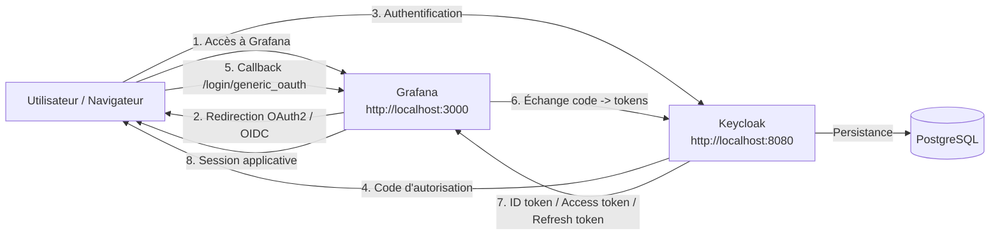

# Architecture SSO Keycloak + Grafana

## Vue d'ensemble

Le dépôt orchestre trois composants:

- `PostgreSQL` pour la persistance des données Keycloak
- `Keycloak` comme fournisseur d'identité OpenID Connect
- `Grafana` comme application cliente consommant le SSO

## Schéma architectural

## Flux d'authentification

1. L'utilisateur ouvre Grafana.
2. Grafana déclenche le flux OpenID Connect vers Keycloak.
3. Keycloak authentifie l'utilisateur sur le realm `company`.
4. Keycloak renvoie un code d'autorisation à Grafana.
5. Grafana échange ce code contre des jetons OAuth2/OIDC.
6. Grafana extrait l'identité, l'email et les rôles pour créer ou mettre à jour la session.

## Mapping des rôles

Le mapping proposé dans ce dépôt est le suivant:

- `platform-admin` -> `Admin`
- `manager` -> `Editor`
- tout autre utilisateur authentifié -> `Viewer`
