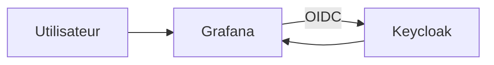

# Integration Grafana avec Keycloak

## Objectif

Configurer `Grafana` comme application tierce utilisant `Keycloak` en OpenID Connect pour le SSO.

Ce document suppose que:

- la plateforme Keycloak est déjà déployée
- tu disposes d'un realm fonctionnel
- tu veux intégrer Grafana proprement, sans mélanger son déploiement avec la stack IAM

Un exemple de stack séparée est fourni dans:

- [deployments/grafana/docker-compose.yml](/root/Keycloak/deployments/grafana/docker-compose.yml)
- [deployments/grafana/.env.example](/root/Keycloak/deployments/grafana/.env.example)

## Architecture cible



## Informations à préparer

Avant de configurer Grafana, définis:

- le nom du realm
- le nom du client Keycloak
- l'URL publique de Grafana
- les rôles Keycloak à exploiter

Exemple retenu dans cette documentation:

- realm: `Grafana`
- client: `grafana-oauth`
- URL Grafana: `http://localhost:3000`

## Etape 1 - Préparer Keycloak

Dans le realm cible:

1. crée les rôles de realm si nécessaire:
- `platform-admin`
- `manager`
- `user`
2. crée les groupes si nécessaire:
- `admins`
- `managers`
- `employees`
3. affecte les rôles aux groupes

Mapping recommandé:

- `admins` -> `platform-admin`
- `managers` -> `manager`
- `employees` -> `user`

## Etape 2 - Créer le client Grafana dans Keycloak

Dans `Clients`:

1. clique sur `Create client`
2. choisis `OpenID Connect`
3. saisis `grafana-oauth`
4. continue vers l'étape suivante

Réglages de capacité:

- `Client authentication`: `ON`
- `Authorization`: `OFF`
- `Standard flow`: `ON`
- `Direct access grants`: `OFF`
- `Implicit flow`: `OFF`
- `Service accounts roles`: `OFF`

Réglages d'URL:

- `Root URL`: `http://localhost:3000`
- `Home URL`: `http://localhost:3000`
- `Valid redirect URIs`: `http://localhost:3000/login/generic_oauth`
- `Valid post logout redirect URIs`: `http://localhost:3000`
- `Web origins`: `http://localhost:3000`
- `Admin URL`: `http://localhost:3000`

## Etape 3 - Récupérer le secret du client

Dans `Clients` -> `grafana-oauth` -> `Credentials`:

1. copie le `Client secret`
2. stocke-le dans ton mécanisme habituel de secrets

## Etape 4 - Configurer Grafana

### Option recommandée

Utiliser la stack séparée fournie dans `deployments/grafana/`.

Exemple:

```bash
cd deployments/grafana
cp .env.example .env
docker compose up -d
```

Dans ce mode séparé:

- Grafana tourne dans sa propre stack
- Keycloak reste dans la stack IAM
- `KEYCLOAK_INTERNAL_URL` utilise `http://host.docker.internal:8080`

Exemple de variables à injecter dans la stack Grafana:

```env
GF_SERVER_ROOT_URL=http://localhost:3000
GF_AUTH_GENERIC_OAUTH_ENABLED=true
GF_AUTH_GENERIC_OAUTH_NAME=Keycloak SSO
GF_AUTH_GENERIC_OAUTH_ALLOW_SIGN_UP=true
GF_AUTH_GENERIC_OAUTH_CLIENT_ID=grafana-oauth
GF_AUTH_GENERIC_OAUTH_CLIENT_SECRET=ChangeThisGrafanaClientSecret!
GF_AUTH_GENERIC_OAUTH_SCOPES=openid profile email offline_access roles
GF_AUTH_GENERIC_OAUTH_AUTH_URL=http://localhost:8080/realms/Grafana/protocol/openid-connect/auth
GF_AUTH_GENERIC_OAUTH_TOKEN_URL=http://keycloak:8080/realms/Grafana/protocol/openid-connect/token
GF_AUTH_GENERIC_OAUTH_API_URL=http://keycloak:8080/realms/Grafana/protocol/openid-connect/userinfo
GF_AUTH_GENERIC_OAUTH_LOGIN_ATTRIBUTE_PATH=preferred_username
GF_AUTH_GENERIC_OAUTH_NAME_ATTRIBUTE_PATH=name
GF_AUTH_GENERIC_OAUTH_EMAIL_ATTRIBUTE_PATH=email
GF_AUTH_GENERIC_OAUTH_ROLE_ATTRIBUTE_PATH=contains(realm_access.roles[*], 'platform-admin') && 'Admin' || contains(realm_access.roles[*], 'manager') && 'Editor' || 'Viewer'
GF_AUTH_GENERIC_OAUTH_USE_REFRESH_TOKEN=true
GF_AUTH_SIGNOUT_REDIRECT_URL=http://localhost:8080/realms/Grafana/protocol/openid-connect/logout?post_logout_redirect_uri=http://localhost:3000
GF_USERS_AUTO_ASSIGN_ORG_ROLE=Viewer
GF_AUTH_DISABLE_LOGIN_FORM=false
```

## Etape 5 - Tester le SSO

1. ouvre Grafana
2. clique sur `Sign in with Keycloak SSO`
3. authentifie-toi dans Keycloak
4. vérifie le rôle final dans Grafana

Capture de référence:


## Mapping des rôles

Le mapping proposé est:

- `platform-admin` -> `Admin`
- `manager` -> `Editor`
- autre utilisateur authentifié -> `Viewer`

## Contrôles à faire

- l'URL de redirection pointe vers le bon realm
- le client `grafana-oauth` existe dans Keycloak
- `Client authentication` est activé
- le secret Grafana correspond au secret Keycloak
- l'utilisateur de test existe dans le bon realm
- les groupes et rôles sont cohérents

## Dépannage rapide

Si Grafana redirige vers un mauvais realm:

- vérifie le nom du realm dans la configuration Grafana
- redémarre Grafana après modification

Si Keycloak renvoie `Page not found`:

- vérifie que le realm existe vraiment
- vérifie la casse exacte du nom du realm

Si le login réussit mais que les droits sont faux:

- vérifie les groupes de l'utilisateur
- vérifie le `Role mapping`
- vérifie l'expression `GF_AUTH_GENERIC_OAUTH_ROLE_ATTRIBUTE_PATH`

## Captures disponibles

Les captures fournies dans le dépôt peuvent être utilisées comme support visuel pendant l'intégration:

- [keycloak-admin-login.png](/root/Keycloak/docs/images/keycloak-admin-login.png)
- [keycloak-create-realm.png](/root/Keycloak/docs/images/keycloak-create-realm.png)
- [keycloak-user-details.png](/root/Keycloak/docs/images/keycloak-user-details.png)
- [keycloak-group-role-mapping.png](/root/Keycloak/docs/images/keycloak-group-role-mapping.png)
- [keycloak-user-set-password.png](/root/Keycloak/docs/images/keycloak-user-set-password.png)
- [keycloak-groups-overview.png](/root/Keycloak/docs/images/keycloak-groups-overview.png)
- [keycloak-client-grafana-settings.png](/root/Keycloak/docs/images/keycloak-client-grafana-settings.png)
- [keycloak-client-grafana-authentication.png](/root/Keycloak/docs/images/keycloak-client-grafana-authentication.png)
- [keycloak-client-grafana-credentials.png](/root/Keycloak/docs/images/keycloak-client-grafana-credentials.png)
- [grafana-sso-error-page-not-found.png](/root/Keycloak/docs/images/grafana-sso-error-page-not-found.png)
- [grafana-sso-realm-url.png](/root/Keycloak/docs/images/grafana-sso-realm-url.png)
- [grafana-login-screen.png](/root/Keycloak/docs/images/grafana-login-screen.png)
