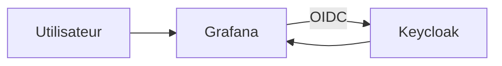
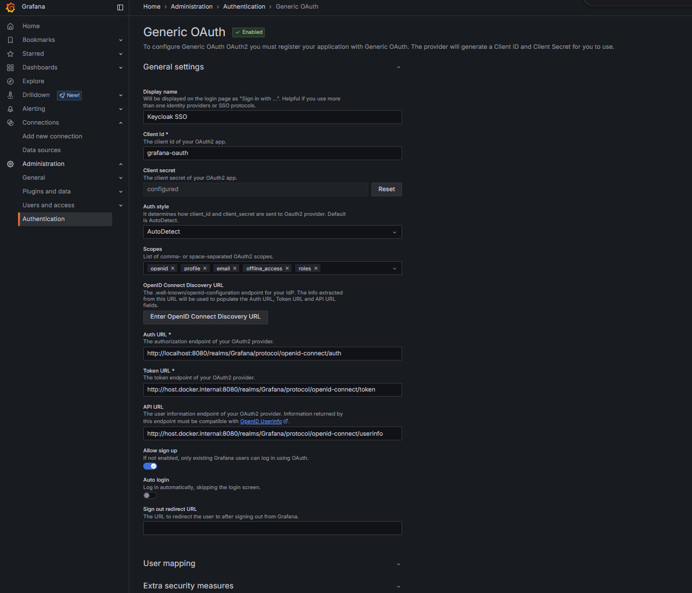
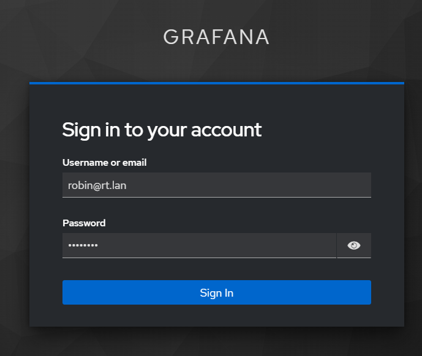

# Integration Grafana avec Keycloak

## Objectif

Configurer `Grafana` comme application tierce utilisant `Keycloak` en OpenID Connect pour le SSO.

Ce document suppose que:

- la plateforme Keycloak est déjà déployée
- tu disposes d'un realm fonctionnel
- tu veux intégrer Grafana proprement, sans mélanger son déploiement avec la stack IAM

Un exemple de stack séparée est fourni dans:

- [deployments/grafana/docker-compose.yml](/root/Keycloak/deployments/grafana/docker-compose.yml)
- [deployments/grafana/.env.example](/root/Keycloak/deployments/grafana/.env.example)

## Architecture cible



## Informations à préparer

Avant de configurer Grafana, définis:

- le nom du realm
- le nom du client Keycloak
- l'URL publique de Grafana
- les rôles Keycloak à exploiter

Exemple retenu dans cette documentation:

- realm: `Grafana`
- client: `grafana-oauth`
- URL Grafana: `http://localhost:3000`

## Etape 1 - Préparer Keycloak

Dans le realm cible:

1. crée les rôles de realm si nécessaire:
- `platform-admin`
- `manager`
- `user`
2. crée les groupes si nécessaire:
- `admins`
- `managers`
- `employees`
3. affecte les rôles aux groupes

Mapping recommandé:

- `admins` -> `platform-admin`
- `managers` -> `manager`
- `employees` -> `user`

## Etape 2 - Créer le client Grafana dans Keycloak

Dans `Clients`:

1. clique sur `Create client`
2. choisis `OpenID Connect`
3. saisis `grafana-oauth`
4. continue vers l'étape suivante

Réglages de capacité:

- `Client authentication`: `ON`
- `Authorization`: `OFF`
- `Standard flow`: `ON`
- `Direct access grants`: `OFF`
- `Implicit flow`: `OFF`
- `Service accounts roles`: `OFF`

Réglages d'URL:

- `Root URL`: `http://localhost:3000`
- `Home URL`: `http://localhost:3000`
- `Valid redirect URIs`: `http://localhost:3000/login/generic_oauth`
- `Valid post logout redirect URIs`: `http://localhost:3000`
- `Web origins`: `http://localhost:3000`
- `Admin URL`: `http://localhost:3000`

## Etape 3 - Récupérer le secret du client

Dans `Clients` -> `grafana-oauth` -> `Credentials`:

1. copie le `Client secret`
2. stocke-le dans ton mécanisme habituel de secrets

## Etape 4 - Configurer Grafana

### Option recommandée

Utiliser la stack séparée fournie dans `deployments/grafana/`, sans injecter la configuration SSO par variables.

Exemple:

```bash
cd deployments/grafana
cp .env.example .env
docker compose up -d
```

Dans ce mode:

- Grafana tourne dans sa propre stack
- Keycloak reste dans la stack IAM
- la configuration SSO se fait directement dans l'interface Grafana
- les paramètres OAuth ne sont pas imposés par des variables d'environnement

### Pourquoi cette approche

Si tu définis `GF_AUTH_GENERIC_OAUTH_*` dans l'environnement:

- Grafana prend ces valeurs comme source de vérité
- le paramétrage manuel dans le GUI devient plus difficile à comprendre
- certaines options peuvent sembler "bloquées" ou déjà remplies par l'infrastructure

Pour un apprentissage clair, il est préférable de:

- garder un `docker-compose` Grafana minimal
- configurer Generic OAuth directement dans l'interface Grafana

### Variables minimales réellement utiles

Dans la stack Grafana fournie, seules les variables d'exploitation locale sont conservées:

```env
GF_SECURITY_ADMIN_USER=admin
GF_SECURITY_ADMIN_PASSWORD=ChangeThisGrafanaAdminPassword!
GF_SERVER_ROOT_URL=http://localhost:3000
```

### Configuration manuelle dans le GUI Grafana

Dans Grafana:

1. ouvre `Administration`
2. ouvre `Authentication`
3. ouvre `Generic OAuth`
4. active `Generic OAuth`

Capture de référence:



Renseigne les champs suivants:

`Display name`

- `Keycloak SSO`

`Client ID`

- `grafana-oauth`

`Client secret`

- colle le secret récupéré dans Keycloak

`Auth style`

- `AutoDetect`

`Scopes`

- `openid profile email offline_access roles`

`Auth URL`

- `http://localhost:8080/realms/Grafana/protocol/openid-connect/auth`

`Token URL`

- si Grafana tourne dans Docker: `http://host.docker.internal:8080/realms/Grafana/protocol/openid-connect/token`
- si Grafana tourne hors Docker: `http://localhost:8080/realms/Grafana/protocol/openid-connect/token`

`API URL`

- si Grafana tourne dans Docker: `http://host.docker.internal:8080/realms/Grafana/protocol/openid-connect/userinfo`
- si Grafana tourne hors Docker: `http://localhost:8080/realms/Grafana/protocol/openid-connect/userinfo`

`Allow sign up`

- `ON`

`Auto login`

- `OFF` au début, pour faciliter les tests

`Sign out redirect URL`

- `http://localhost:8080/realms/Grafana/protocol/openid-connect/logout?post_logout_redirect_uri=http://localhost:3000`

Dans la section `User mapping`, renseigne:

`Login field path`

- `preferred_username`

`Name field path`

- `name`

`Email field path`

- `email`

`Role attribute path`

```text
contains(realm_access.roles[*], 'platform-admin') && 'Admin' || contains(realm_access.roles[*], 'manager') && 'Editor' || 'Viewer'
```

Puis sauvegarde.

### Tableau de correspondance

Le tableau suivant permet de savoir rapidement où chaque paramètre doit être défini.

| Sujet | Keycloak GUI | Grafana GUI | Variable d'environnement |
| --- | --- | --- | --- |
| Nom du realm | oui | non | indirectement via les URL |
| Client ID | oui | oui | `GF_AUTH_GENERIC_OAUTH_CLIENT_ID` |
| Client secret | oui | oui | `GF_AUTH_GENERIC_OAUTH_CLIENT_SECRET` |
| Redirect URI | oui | non | non |
| Web origins | oui | non | non |
| Auth URL | non | oui | `GF_AUTH_GENERIC_OAUTH_AUTH_URL` |
| Token URL | non | oui | `GF_AUTH_GENERIC_OAUTH_TOKEN_URL` |
| API URL / UserInfo | non | oui | `GF_AUTH_GENERIC_OAUTH_API_URL` |
| Scopes | non | oui | `GF_AUTH_GENERIC_OAUTH_SCOPES` |
| Display name du bouton SSO | non | oui | `GF_AUTH_GENERIC_OAUTH_NAME` |
| Allow sign up | non | oui | `GF_AUTH_GENERIC_OAUTH_ALLOW_SIGN_UP` |
| Auto login | non | oui | selon méthode de déploiement |
| Login field path | non | oui | `GF_AUTH_GENERIC_OAUTH_LOGIN_ATTRIBUTE_PATH` |
| Name field path | non | oui | `GF_AUTH_GENERIC_OAUTH_NAME_ATTRIBUTE_PATH` |
| Email field path | non | oui | `GF_AUTH_GENERIC_OAUTH_EMAIL_ATTRIBUTE_PATH` |
| Role attribute path | non | oui | `GF_AUTH_GENERIC_OAUTH_ROLE_ATTRIBUTE_PATH` |
| Sign out redirect URL | partiellement, via logout client | oui | `GF_AUTH_SIGNOUT_REDIRECT_URL` |
| Utilisateurs, groupes, rôles | oui | non | non |

Règle simple:

- ce qui décrit l'identité et le client OIDC se configure dans Keycloak
- ce qui décrit comment Grafana consomme ce client se configure dans Grafana
- les variables d'environnement servent à automatiser la configuration Grafana, pas à remplacer Keycloak

### Quand utiliser les variables d'environnement

L'approche par variables est utile si:

- tu veux automatiser complètement le déploiement
- tu ne veux pas dépendre d'un réglage manuel dans l'interface
- tu veux versionner la configuration non sensible

En revanche, pour comprendre le fonctionnement, le GUI est souvent plus pédagogique.

## Etape 5 - Tester le SSO

1. ouvre Grafana
2. clique sur `Sign in with Keycloak SSO`
3. authentifie-toi dans Keycloak
4. vérifie le rôle final dans Grafana

Capture de référence:



## Mapping des rôles

Le mapping proposé est:

- `platform-admin` -> `Admin`
- `manager` -> `Editor`
- autre utilisateur authentifié -> `Viewer`

## Contrôles à faire

- l'URL de redirection pointe vers le bon realm
- le client `grafana-oauth` existe dans Keycloak
- `Client authentication` est activé
- le secret Grafana correspond au secret Keycloak
- l'utilisateur de test existe dans le bon realm
- les groupes et rôles sont cohérents

## Dépannage rapide

Si Grafana redirige vers un mauvais realm:

- vérifie le nom du realm dans la configuration Grafana
- redémarre Grafana après modification

Si `User sync failed` apparaît:

- vérifie que l'utilisateur existe bien dans le realm cible
- vérifie qu'il a un mot de passe
- vérifie qu'il appartient au bon groupe
- si Grafana a déjà connu plusieurs tentatives incohérentes, repartir d'un volume Grafana neuf peut simplifier le diagnostic

Si Keycloak renvoie `Page not found`:

- vérifie que le realm existe vraiment
- vérifie la casse exacte du nom du realm

Si le login réussit mais que les droits sont faux:

- vérifie les groupes de l'utilisateur
- vérifie le `Role mapping`
- vérifie l'expression `GF_AUTH_GENERIC_OAUTH_ROLE_ATTRIBUTE_PATH`

## Captures disponibles

Les captures fournies dans le dépôt peuvent être utilisées comme support visuel pendant l'intégration:

- [keycloak-admin-login.png](/root/Keycloak/docs/images/keycloak-admin-login.png)
- [keycloak-create-realm.png](/root/Keycloak/docs/images/keycloak-create-realm.png)
- [keycloak-user-details.png](/root/Keycloak/docs/images/keycloak-user-details.png)
- [keycloak-group-role-mapping.png](/root/Keycloak/docs/images/keycloak-group-role-mapping.png)
- [keycloak-user-set-password.png](/root/Keycloak/docs/images/keycloak-user-set-password.png)
- [keycloak-groups-overview.png](/root/Keycloak/docs/images/keycloak-groups-overview.png)
- [keycloak-client-grafana-settings.png](/root/Keycloak/docs/images/keycloak-client-grafana-settings.png)
- [keycloak-client-grafana-authentication.png](/root/Keycloak/docs/images/keycloak-client-grafana-authentication.png)
- [keycloak-client-grafana-credentials.png](/root/Keycloak/docs/images/keycloak-client-grafana-credentials.png)
- [grafana-sso-error-page-not-found.png](/root/Keycloak/docs/images/grafana-sso-error-page-not-found.png)
- [grafana-sso-realm-url.png](/root/Keycloak/docs/images/grafana-sso-realm-url.png)
- [grafana-generic-oauth-settings.png](/root/Keycloak/docs/images/grafana-generic-oauth-settings.png)
- [grafana-login-screen.png](/root/Keycloak/docs/images/grafana-login-screen.png)
