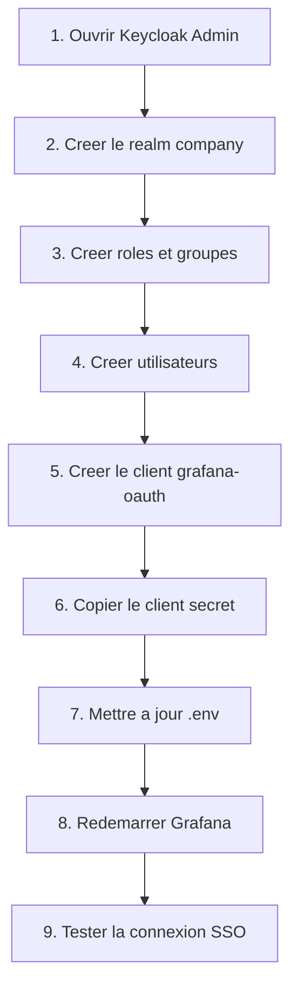

# Checklist Visuelle Admin Keycloak pour Grafana SSO

Cette page est pensée comme une fiche d'exécution rapide pendant que tu configures `Keycloak` à la main.

Elle complète le guide détaillé [grafana-sso-step-by-step.md](/root/Keycloak/docs/grafana-sso-step-by-step.md).

## Vue rapide



## Checklist 1 - Accès à l'admin

Ecran à ouvrir:

- `http://localhost:8080/admin`

A vérifier:

- tu peux te connecter avec le compte admin bootstrap
- le realm `company` est visible dans le sélecteur de realm

Valeurs utiles:

- utilisateur: `KC_BOOTSTRAP_ADMIN_USERNAME`
- mot de passe: `KC_BOOTSTRAP_ADMIN_PASSWORD`

Contrôle visuel attendu:

- tu vois la console d'administration Keycloak
- tu es connecté sur l'admin Keycloak

Capture suggérée:

- page d'accueil de l'admin Keycloak

## Checklist 2 - Création du realm

Chemin:

- sélecteur de realm -> `Create realm`

Valeur à saisir:

| Champ | Valeur |
| --- | --- |
| Realm name | `company` |

Réglages recommandés:

- `User registration`: `OFF`
- `Login with email`: `ON`
- `Duplicate emails`: `OFF`
- `Verify email`: `ON`
- `Forgot password`: `ON`
- `Remember me`: `ON`

Contrôle visuel attendu:

- le realm `company` apparaît dans le sélecteur
- le realm actif devient `company`

Capture suggérée:

- écran de création du realm

## Checklist 3 - Création des rôles

Chemin:

- `Realm roles`

Rôles à créer:

| Rôle | Usage |
| --- | --- |
| `platform-admin` | admin Grafana |
| `manager` | éditeur Grafana |
| `user` | utilisateur standard |

Contrôle visuel attendu:

- les trois rôles sont visibles dans la liste

Capture suggérée:

- liste des rôles du realm

## Checklist 4 - Création des groupes

Chemin:

- `Groups`

Groupes à créer:

| Groupe | Rôle associé |
| --- | --- |
| `admins` | `platform-admin` |
| `managers` | `manager` |
| `employees` | `user` |

A faire:

1. Créer les groupes
2. Ouvrir chaque groupe
3. Aller dans `Role mapping`
4. Assigner le rôle de realm correspondant

Contrôle visuel attendu:

- chaque groupe a bien son rôle associé

Capture suggérée:

- écran `Role mapping` d'un groupe

## Checklist 5 - Création des utilisateurs

Chemin:

- `Users` -> `Add user`

Exemples utiles:

| Utilisateur | Groupe |
| --- | --- |
| `owner@company.local` | `admins` |
| `manager1@company.local` | `managers` |
| `user1@company.local` | `employees` |

A faire:

1. Créer l'utilisateur
2. Définir son mot de passe dans `Credentials`
3. Lui affecter un groupe dans `Groups`

Contrôle visuel attendu:

- l'utilisateur est `Enabled`
- il a un mot de passe
- il est rattaché au bon groupe

Capture suggérée:

- fiche d'un utilisateur avec son groupe

## Checklist 6 - Création du client Grafana

Chemin:

- `Clients` -> `Create client`

Valeurs à saisir:

| Champ | Valeur |
| --- | --- |
| Client type | `OpenID Connect` |
| Client ID | `grafana-oauth` |

Contrôle visuel attendu:

- le client `grafana-oauth` apparaît dans la liste des clients

Capture suggérée:

- écran `Create client` rempli

## Checklist 7 - Capacités du client

Ecran:

- assistant de création du client, étape capacités

Réglages recommandés:

| Option | Valeur |
| --- | --- |
| Client authentication | `ON` |
| Authorization | `OFF` |
| Standard flow | `ON` |
| Direct access grants | `OFF` |
| Implicit flow | `OFF` |
| Service accounts roles | `OFF` |

Pourquoi:

- Grafana utilise ici un client confidentiel en `Authorization Code Flow`

Contrôle visuel attendu:

- `Client authentication` et `Standard flow` sont activés

Capture suggérée:

- écran de capacité avec les bons switches

## Checklist 8 - URLs du client

Ecran:

- assistant de création du client, étape login settings

Valeurs à saisir:

| Champ | Valeur |
| --- | --- |
| Root URL | `http://localhost:3000` |
| Home URL | `http://localhost:3000` |
| Valid redirect URIs | `http://localhost:3000/login/generic_oauth` |
| Valid post logout redirect URIs | `http://localhost:3000` |
| Web origins | `http://localhost:3000` |

Contrôle visuel attendu:

- aucune erreur de validation
- le client peut être sauvegardé

Point d'attention:

- l'URL de callback doit être exactement `/login/generic_oauth`

Capture suggérée:

- écran login settings complété

## Checklist 9 - Secret du client

Chemin:

- `Clients` -> `grafana-oauth` -> `Credentials`

A faire:

1. Copier le `Client secret`
2. Ouvrir le fichier `.env`
3. Remplacer `GRAFANA_OAUTH_CLIENT_SECRET`

Exemple:

```env
GRAFANA_OAUTH_CLIENT_SECRET=colle-ici-le-secret-keycloak
```

Si tu changes le `Client ID` dans Keycloak:

- mets la même valeur dans `GRAFANA_OAUTH_CLIENT_ID`

Contrôle visuel attendu:

- le secret affiché dans Keycloak correspond à celui défini dans `.env`

Capture suggérée:

- onglet `Credentials`

## Checklist 10 - Redémarrage Grafana

Commande:

```bash
docker compose up -d grafana
```

Contrôle visuel attendu:

- Grafana redémarre sans erreur
- la page `http://localhost:3000` s'ouvre correctement

Si besoin:

```bash
docker compose logs -f grafana
```

## Checklist 11 - Gestion des droits

Objectif:

- décider qui sera `Admin`, `Editor` ou `Viewer` dans Grafana

Mapping configuré côté Grafana:

| Rôle Keycloak | Rôle Grafana |
| --- | --- |
| `platform-admin` | `Admin` |
| `manager` | `Editor` |
| autre cas | `Viewer` |

### Approche A - Par groupes

Bon réflexe:

- affecter les rôles aux groupes
- rattacher les utilisateurs aux groupes

Exemple conseillé:

| Groupe | Rôle de realm |
| --- | --- |
| `admins` | `platform-admin` |
| `managers` | `manager` |
| `employees` | `user` |

Contrôle visuel attendu:

- le groupe montre bien son `Role mapping`

### Approche B - Par utilisateur

Chemin:

- `Users` -> utilisateur -> `Role mapping`

Usage:

- utile pour tester rapidement un compte
- moins propre pour l'exploitation long terme

Contrôle visuel attendu:

- l'utilisateur possède bien le rôle attendu dans l'onglet de mapping

Capture suggérée:

- écran `Role mapping` d'un groupe
- écran `Role mapping` d'un utilisateur

## Checklist 12 - Test SSO final

Chemin de test:

1. Ouvrir `http://localhost:3000`
2. Cliquer sur `Sign in with Keycloak SSO`
3. Se connecter dans Keycloak
4. Revenir dans Grafana

Résultat attendu:

- un utilisateur `platform-admin` devient `Admin`
- un utilisateur `manager` devient `Editor`
- un utilisateur sans rôle spécifique devient `Viewer`

Contrôle visuel attendu:

- l'utilisateur apparaît connecté dans Grafana
- son rôle est cohérent avec ce qui a été assigné dans Keycloak

## Checklist 13 - Diagnostic rapide

Si ça ne fonctionne pas, vérifie dans cet ordre:

- le realm actif est bien `company`
- les rôles `platform-admin`, `manager` et `user` existent
- les groupes sont bien créés et mappés
- le client s'appelle bien `grafana-oauth`
- le secret du client est bien le même dans Keycloak et dans `.env`
- l'URI `http://localhost:3000/login/generic_oauth` est présente dans `Valid redirect URIs`
- Grafana a bien été redémarré après modification du secret
- l'utilisateur testé possède vraiment le bon rôle ou le bon groupe

Commandes utiles:

```bash
docker compose logs -f keycloak
docker compose logs -f grafana
```

## Mini check de fin

Tu peux considérer que la configuration est bonne si:

- le realm `company` existe
- les rôles et groupes existent
- le client `grafana-oauth` existe
- le secret est synchronisé avec `.env`
- un utilisateur se connecte à Grafana via Keycloak
- son rôle Grafana reflète bien son rôle ou son groupe Keycloak
