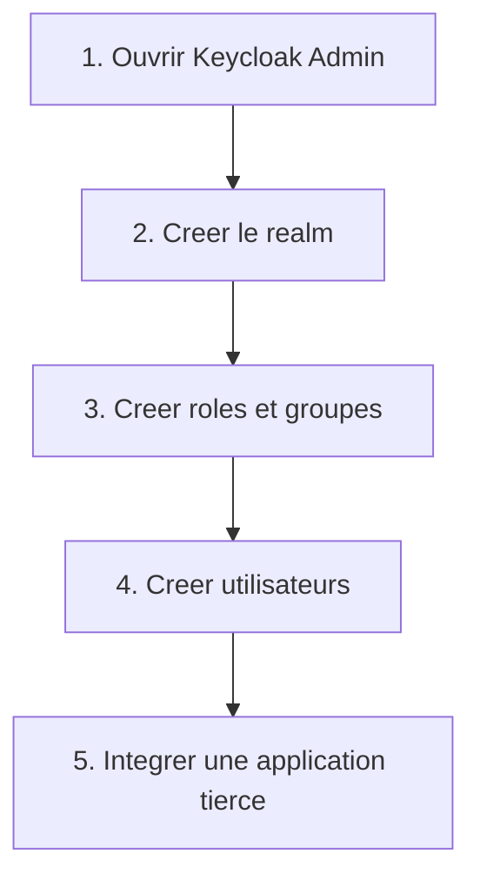
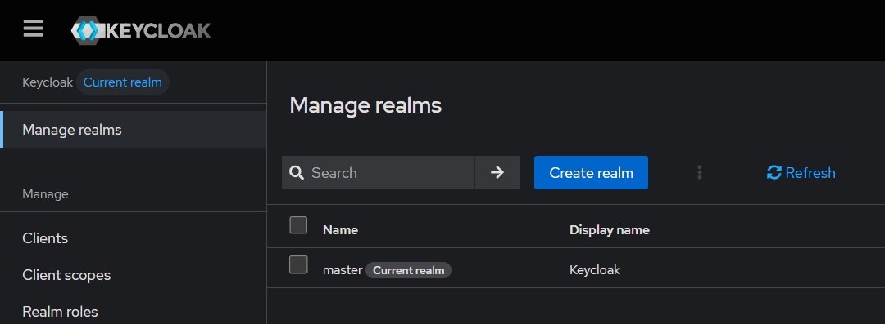
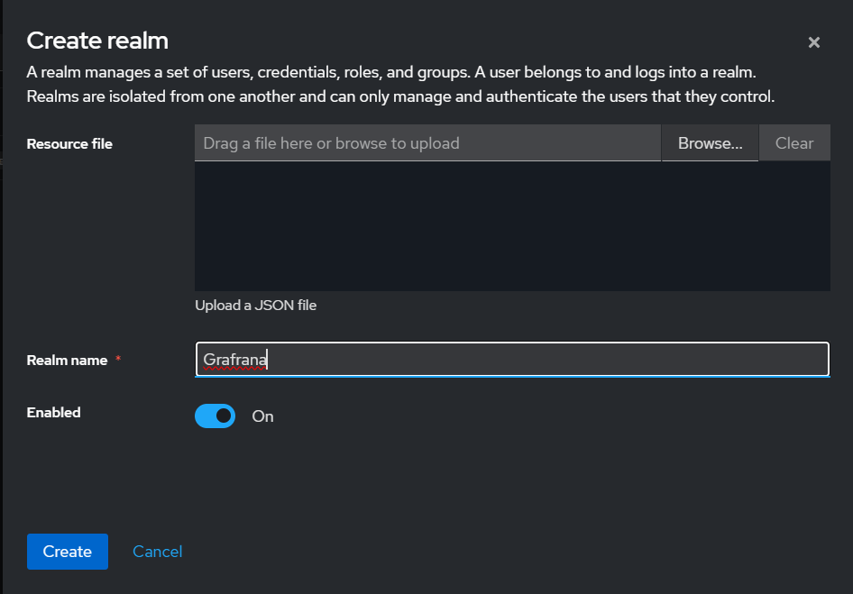
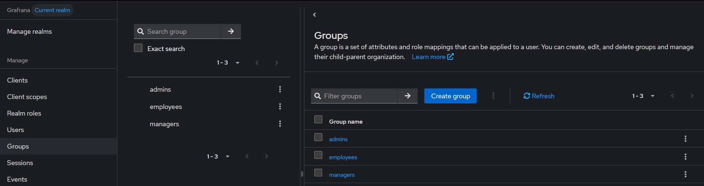
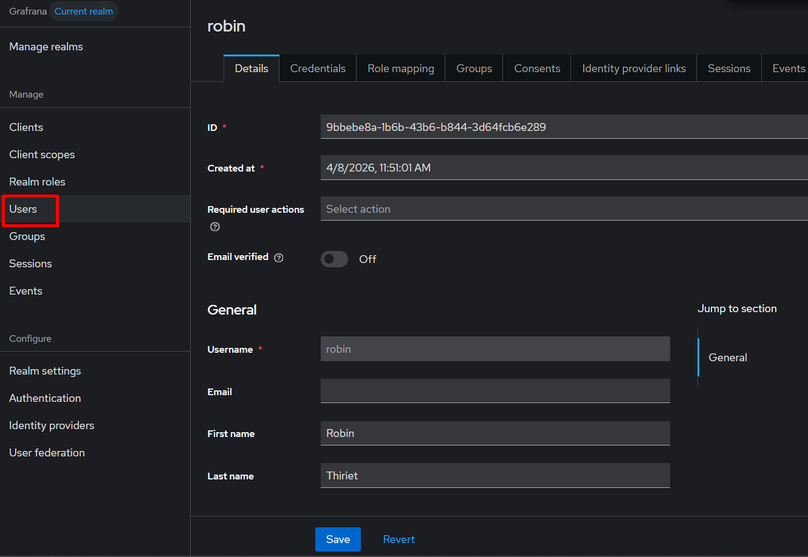
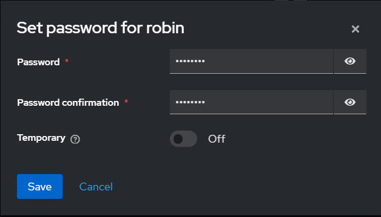
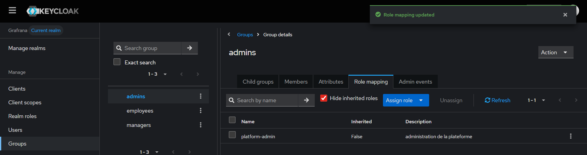

# Checklist Admin Keycloak

Cette page sert de fiche d'exécution rapide pour initialiser proprement une plateforme IAM Keycloak.

Elle couvre la base d'administration avant d'intégrer des applications tierces.

## Vue rapide

## Checklist 1 - Accès à l'admin

Ecran à ouvrir:

- `http://localhost:8080/admin`

A vérifier:

- tu peux te connecter avec le compte admin bootstrap
- seul le realm `master` existe au premier démarrage

Valeurs utiles:

- utilisateur: `KC_BOOTSTRAP_ADMIN_USERNAME`
- mot de passe: `KC_BOOTSTRAP_ADMIN_PASSWORD`

Capture de référence:

## Checklist 2 - Création du realm

Chemin:

- sélecteur de realm -> `Create realm`

Valeur à saisir:

| Champ | Valeur |
| --- | --- |
| Realm name | `company` |

Réglages recommandés:

- `User registration`: `OFF`
- `Login with email`: `ON`
- `Duplicate emails`: `OFF`
- `Verify email`: `ON`
- `Forgot password`: `ON`
- `Remember me`: `ON`

Capture de référence:

## Checklist 3 - Création des rôles

Chemin:

- `Realm roles`

Rôles à créer:

| Rôle | Usage |
| --- | --- |
| `platform-admin` | administration plateforme |
| `manager` | droits avancés |
| `user` | utilisateur standard |

## Checklist 4 - Création des groupes

Chemin:

- `Groups`

Groupes à créer:

| Groupe | Rôle associé |
| --- | --- |
| `admins` | `platform-admin` |
| `managers` | `manager` |
| `employees` | `user` |

A faire:

1. créer les groupes
2. ouvrir chaque groupe
3. aller dans `Role mapping`
4. assigner le rôle de realm correspondant

Captures de référence:

## Checklist 5 - Création des utilisateurs

Chemin:

- `Users` -> `Add user`

Exemples utiles:

| Utilisateur | Groupe |
| --- | --- |
| `admin1@company.local` | `admins` |
| `manager1@company.local` | `managers` |
| `user1@company.local` | `employees` |

A faire:

1. créer l'utilisateur
2. définir son mot de passe dans `Credentials`
3. lui affecter un groupe dans `Groups`

Captures de référence:

## Checklist 6 - Intégration d'une application tierce

Pour intégrer une application comme Grafana:

1. créer un client dans le realm cible
2. définir les `redirect URIs`
3. récupérer le secret si le client est confidentiel
4. configurer l'application côté client
5. valider le mapping des rôles

Guide disponible dans ce dépôt:

- [Grafana](/root/Keycloak/docs/integrations/grafana.md)

## Checklist 7 - Diagnostic rapide

Si une intégration ne fonctionne pas:

- vérifier le nom exact du realm
- vérifier la casse du realm
- vérifier le client créé dans Keycloak
- vérifier les `redirect URIs`
- vérifier le secret du client
- vérifier les groupes et rôles de l'utilisateur

## Mini check de fin

La base IAM est prête si:

- le realm existe
- les rôles existent
- les groupes existent
- les utilisateurs existent
- au moins une application tierce peut être intégrée proprement
